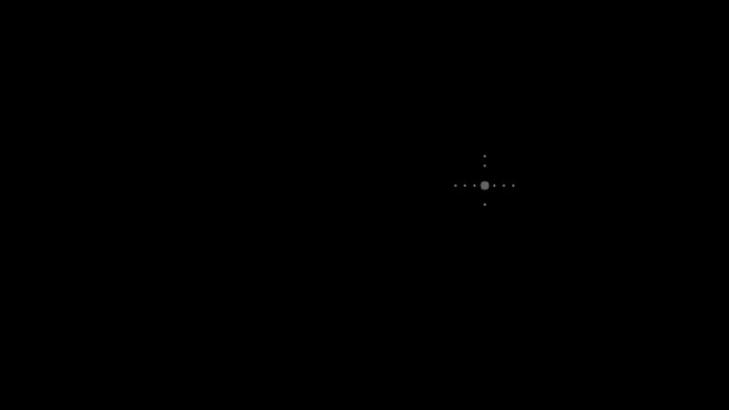
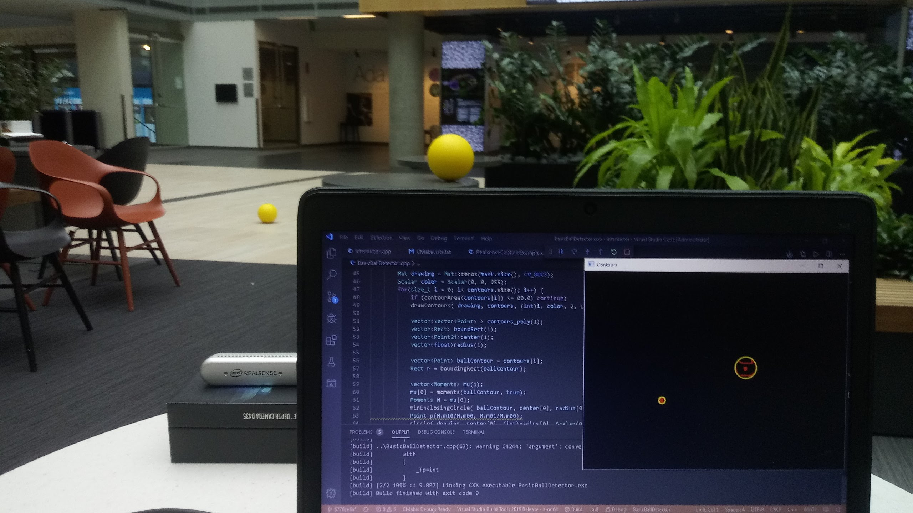
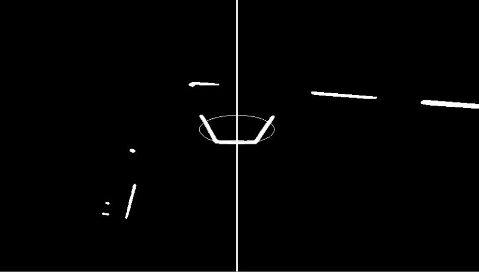

# High-School-Vision-Robotics
**Locating balls and targets for the FIRST Robotics Competition.**

*Ball_Detector.cpp* is a program that returns the distance and yaw to the nearest ball in frame. This was particularly useful for fast acquisition of the ball game objects. It uses color and depth data from an Intel Realsense D435. I am the sole contributor to this version.

**NOTE:** Please be aware that the code is messy. I wrote it in high school before I learned clean code. I reorganized some of its structure at the time of this commit without a Realsense camera and balls. Please be aware that there may be errors. I cannot re-test until I get access to these resources. 

*Running Ball_Detector. The points seen in the image represent a single ball and are used for distance calculations.*

*Running an early version of Ball_Detector. This was early version testing at Microsoft Building 99.*

*camera.cpp* is a program that configures and provides the input frames from the Realsense camera on the robot. This was used for the targeting system that centered the robot to the detected target. I was a contributor.

**NOTE:** 60% of the code was omitted due to privacy concerns. The code that is left was the part that I contributed to.

*Running the target detector. The oval is the bounding circle of the target and the vertical center line is the center of the image. Notice that the target and center line are aligned.*

